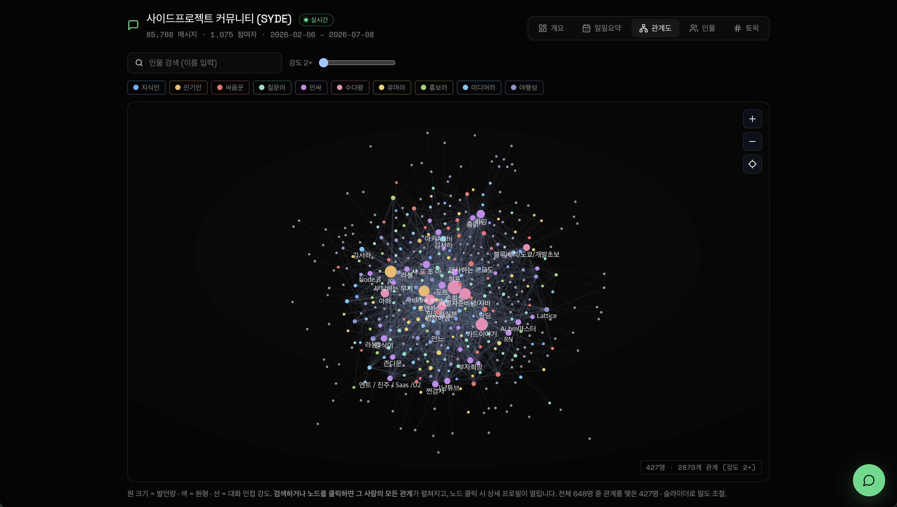
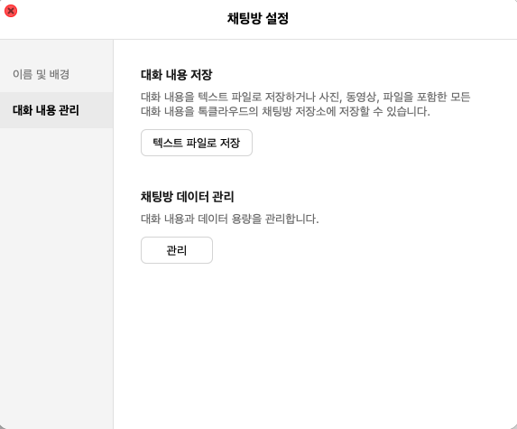

<div align="center">

# OurChat · `kakao-ourchat`

**Turn our group chat into a knowledge graph — people, ties, topics, and fun.**

Turn a KakaoTalk group chat into an interactive knowledge-graph dashboard:
relationship graph, activity & persona rankings, per-person AI profiles, topics
over time, and day/week/month conversation-flow narratives.

<br/>

[](https://syde.moche.ai/)


*Local-first chat analytics · works offline · optional bring-your-own LLM · no decryption*

**[한국어](README.md)** · **English**

<br/>

<a href="https://syde.moche.ai/"></a>

<sub>▶ <b><a href="https://syde.moche.ai/">Live demo</a></b> — a real ~83,000-message community rendered as a knowledge graph.</sub>

</div>

> **Privacy-first & legal by design.** OurChat reads the **official KakaoTalk chat
> export** (`대화 내용 내보내기` → `.csv`/`.txt`) that any member can produce. It does
> **not** decrypt, dump, or reverse-engineer the KakaoTalk database. Everything runs
> **locally** by default. *Not affiliated with or endorsed by Kakao.*

---

## Quickstart

```bash
git clone https://github.com/jutalik/kakao-ourchat
cd kakao-ourchat
pip install -r requirements.txt          # numpy + scikit-learn (that's it, for offline mode)

# try it on the bundled synthetic sample — zero real data, zero servers
python -m ourchat demo

# ...or your own room — first export it (see docs/EXPORTING.md):
#   KakaoTalk → chat settings → 대화 내용 관리 → 대화 내용 저장 → 텍스트 파일로 저장
python -m ourchat analyze ~/Downloads/KakaoTalkChats.csv --room "our room"

# later, export again and keep it current (merges + dedups, continues from last):
python -m ourchat analyze ~/Downloads/KakaoTalkChats_july.csv --room "our room" --append

python -m ourchat serve                  # → http://localhost:4173  (needs Node.js — builds the dashboard on first run)
```

**Exporting your chat** (do it once): in KakaoTalk open the room → chat settings →
**대화 내용 관리** → **대화 내용 저장** → **텍스트 파일로 저장** (see [`docs/EXPORTING.md`](docs/EXPORTING.md)).



**Hosting:** run it locally, on a home server/VPS, or put it online (Cloudflare Tunnel,
reverse proxy + password) — see [`docs/HOSTING.md`](docs/HOSTING.md).

## Two ways to run (both free & open)

| Mode | How | You get |
|------|-----|---------|
| **Offline (default)** | just `pip install`, no LLM, no servers | universal behavior-based personas, relationship graph, rankings, topics (TF-IDF), deterministic summaries |
| **Bring-your-own AI** | set `KAKAO_LLM_*` (OpenAI / Anthropic / Ollama / any local model) | **room-tailored** personas & criteria, AI topic names, narratives, and character profiles — pre-generated into static JSON |

Everything is **fully useful with no LLM**. An LLM (your own key, or a local model —
your choice) just makes it richer and **adapts the analysis to *your* room** instead of
a fixed template: a family chat, a gaming clan, a study group and a dev community each
get their own archetypes. *(Optional: better topic clusters via a `OURCHAT_EMBED`
embeddings endpoint — again, your own/local, no service required.)*

```bash
# bring your own OpenAI key
export KAKAO_LLM_PROVIDER=openai KAKAO_LLM_MODEL=gpt-4o-mini KAKAO_LLM_API_KEY=sk-...
# or a fully local model via Ollama
export KAKAO_LLM_PROVIDER=openai KAKAO_LLM_BASE_URL=http://localhost:11434/v1 KAKAO_LLM_MODEL=qwen2.5
python -m ourchat analyze chats.csv --room "our room"
```

## What it computes

- **Relationship graph** — who talks to whom (reply-adjacency), interactive canvas graph, ego view.
- **Rankings** — most active, connectors, per-persona leaderboards.
- **Personas** — adaptive archetypes, or LLM-tailored to your room.
- **Topics over time** — clusters with weekly hotness and who drove them.
- **Daily / weekly / monthly** conversation-flow digests.
- **Per-person profiles** — data-grounded character analysis (LLM mode).

## Tips for the best results (read this if an agent is running it for you)

Zero config works, but quality scales with what you give it:

1. **Turn on embeddings for much better topic clusters.** Default is offline TF-IDF.
   An embeddings model groups messages by *meaning*, so topics — and the topic
   charts — come out cleaner. **Higher-dimensional embeddings = better charts** (e.g.
   `text-embedding-3-large` 3072-dim, or a local 4096-dim model, separate topics more
   sharply than a small 384/768-dim one). If topics look muddy, use a bigger embedding
   model and/or raise `--k`.
   ```bash
   # OpenAI-compatible (OpenAI / Ollama / vLLM / LM Studio):
   export OURCHAT_EMBED=api OURCHAT_EMBED_MODEL=text-embedding-3-large \
          OURCHAT_EMBED_URL=https://api.openai.com/v1/embeddings OURCHAT_EMBED_KEY=sk-...
   # fully local, no key:
   export OURCHAT_EMBED=api OURCHAT_EMBED_MODEL=nomic-embed-text \
          OURCHAT_EMBED_URL=http://localhost:11434/v1/embeddings
   ```
2. **Add a capable LLM** (`gpt-4o-mini`, `claude-haiku-4-5`, or better) for room-tailored
   personas + topic names + narratives + profiles. Weak models fall back to universal
   personas gracefully.
3. **More history = richer output.** `--append` a later export to accumulate (KakaoTalk
   drops old messages over time).
4. **Knobs:** `--k <n>` topic count (default 20), `OURCHAT_EMBED` (offline|api),
   `KAKAO_LLM_PROVIDER` (none|openai|anthropic).

## How it works

```
export.csv/.txt ─▶ parse_export ─▶ characterize (room rubric) ─▶ analyze ─▶ topics
                                                                     ├─▶ summarize
                                                                     └─▶ daily ─▶ dashboard
                    (LLM optional) ─────────────────────────────────▶ narrate
```

The dashboard is a **static site with no backend** — all AI output is pre-generated into
JSON at analyze time. Supported exports: macOS/iOS `.csv`, and `.txt` from PC/macOS/
Android/iOS (see [`docs/FORMATS.md`](docs/FORMATS.md)).

## FAQ

**Does this decrypt KakaoTalk?** No — it only reads the file you export from the app. No
database access, key recovery, or reverse-engineering. That's the point.

**Do I need an API key?** No. Default is fully offline. An LLM is optional and can be a
local model (Ollama, vLLM).

**Only KakaoTalk?** Today yes, but the pipeline runs on a simple
[corpus contract](AGENTS.md), so a Discord/WhatsApp/Slack importer is a small addition.

**Is it accurate?** Validated against a real 83k-message room; results match a
ground-truth run. Personas are relative to *your* room, not a fixed template.

## Privacy & contributing

A group chat contains **other people's messages** — see [`PRIVACY.md`](PRIVACY.md).
PRs welcome: [`CONTRIBUTING.md`](CONTRIBUTING.md) · [`AGENTS.md`](AGENTS.md) (canonical
guide for humans and AI agents).

## License

[MIT](LICENSE). Not affiliated with Kakao Corp. "KakaoTalk" is a trademark of its owner;
this project only reads files that users export themselves.

<sub>Topics: kakaotalk · 카카오톡 분석 · chat analysis · group-chat analytics · knowledge graph ·
social network analysis · conversation analysis · NLP · data visualization · privacy-first · svelte</sub>
